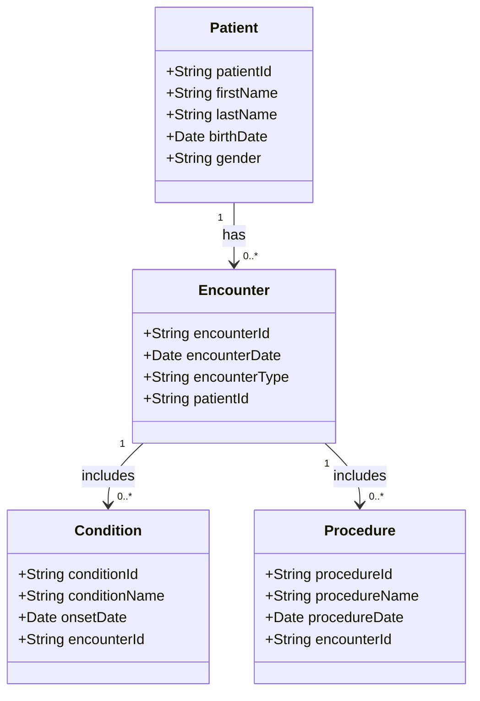

# Sample Mermaid Diagram in Markdown

Here is a class diagram:

```mermaid
classDiagram
    class Patient {
        +String patientId
        +String firstName
        +String lastName
        +Date birthDate
        +String gender
    }
    
    class Encounter {
        +String encounterId
        +Date encounterDate
        +String encounterType
        +String patientId
    }
    
    class Condition {
        +String conditionId
        +String conditionName
        +Date onsetDate
        +String encounterId
    }
    
    class Procedure {
        +String procedureId
        +String procedureName
        +Date procedureDate
        +String encounterId
    }
    
    Patient "1" --> "0..*" Encounter : has
    Encounter "1" --> "0..*" Condition : includes
    Encounter "1" --> "0..*" Procedure : includes
```
