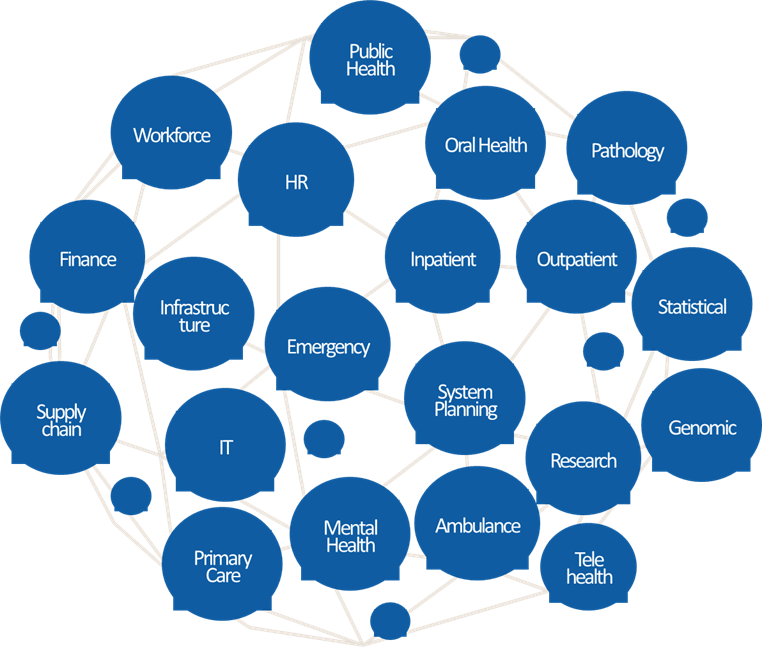

# Level 0 - Enterprise-level context
[Return to home](README.md)

This section outlines the foundational enterprise-wide concepts that inform and guide data and platform architecture decisions across the organisation. It sets the strategic and business context within which all lower-level architectural decisions should be made.

## Why It Matters

Establishing a clear enterprise-level context ensures that investments in data, capabilities, and infrastructure are purposefully aligned with the organisation’s strategic vision, operating model, and capacity. This alignment is essential for delivering meaningful, sustainable outcomes that reflect the organisation’s unique context and long-term goals.

 

## Table of Contents
---

- [Org + Domain Definition](#org-domain-definition)
- [Strategies and Objectives](#strategies-and-objectives)
- [Key Systems and Data Assets](#key-systems-and-data-assets)
- [Team Capabilities and Roles](#team-capabilities-and-roles)
- [Governance Structures](#governance-structures)
- [Billing Structures](#billing-structures)

 
 

## Org + Domain Definition

Understanding the structure of the organisation and its domains is foundational to defining governance, environment and metadata boundaries. While organisations can look to industry patterns and reference architectures for guidance, they are also unique. See [Domain-Centric Design](level_1.md#domain-centric-design) to see further definition.

**Recommended artefacts:**

- Description of the organisational boundary and any external organisations that are within the scope of concern.
- Description of domains and subdomains within the organisation that may have a material bearing on the data governance and data management operating model.

<em>Illustrative example of domains for a Healthcare organisation</em>

 

 

## Strategies and Objectives

This section outlines the strategic context in which data, technology, and governance initiatives operate.

**Recommended artefacts**

- Description of the organisation's strategies and objectives at the whole-of-enterprise level:
  - Business strategies, objectives, plans, and initiatives
  - Technology strategies, objectives, plans, and initiatives
  - Data and AI strategies, objectives, plans, and initiatives

## Key Systems and Data Assets

Identifying the systems and data assets in scope supports effective governance, architecture, and planning.

**Recommended artefacts**

- Description of the organisation's key systems within the scope of concern (e.g., CMDB).
- Information Asset Register (IAR)

## Team Capabilities and Roles

Clarity on the responsibilities and capabilities of key teams is essential for executing data strategy and maintaining accountability.

**Recommended artefacts**

- Description of in-scope key teams/parties associated with:
  - Strategy and portfolio / prioritisation of data initiatives
  - Data creation within the business domains
  - Data management
  - Data governance (quality, access)
  - Data consumption
  - Data engineering and integration
  - Data analysis and reporting
  - Data application development
  - Data ops support
  - Data security
  - Data and information architecture
  - Infrastructure and platform provisioning and management
- RACI matrix for key teams/parties
- Current and target operating and service management model
- Maturity and skill assessment of key teams/parties

## Governance Structures

Governance frameworks and processes define how decisions are made, enforced, and improved across the data lifecycle.

**Recommended artefacts**

- Description of the organisation's governance frameworks, policies, standards, processes, and bodies that are relevant to the scope of concern.

## Billing Structures

Understanding how billing is structured enables transparency, cost accountability, and alignment with financial governance.

**Recommended artefacts**

- Description of the organisation's structures in terms of billing, and how cost centres may relate to billing reports, delegations, and associated observability requirements.
- Cost allocation models and chargeback mechanisms
- Budget management and forecasting processes
- Financial governance and approval workflows
- Cost optimization strategies and monitoring
- Integration with enterprise resource planning (ERP) systems
- Compliance with financial reporting standards and regulations

 
 

## Next Steps

Once the enterprise-level context is established, proceed to [Level 1 - Domain Architecture](level_1.md) to explore domain-centric design principles and architectural patterns that support the organisation's strategic objectives.

---

