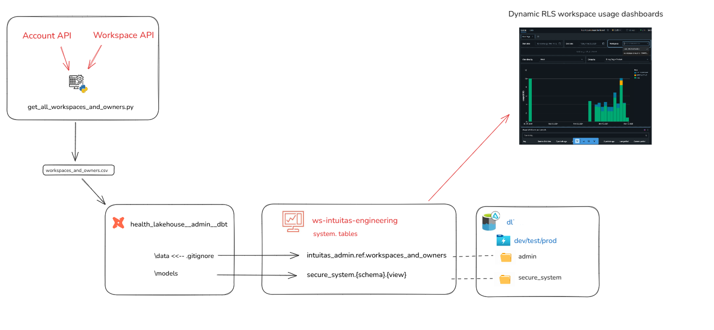

# Level 1 - Enterprise-level architecture
[Return to home](README.md)

This section describes enterprise-wide and cross-domain data and data platform architecture concepts.

<br>

## Table of Contents

- [Key concepts](#key-concepts)
    - [Domain](#domain)
    - [Subdomain](#subdomain)
    - [Domain-Centric Design](#domain-centric-design) 
    - [Data Mesh](#data-mesh)
    - [Domain Topology](#domain-topology)
    - [Data Fabric](#data-fabric)
    - [Data Mesh vs Fabric](#data-mesh-vs-fabric)
- [Reference topologies](#reference-topologies)
- [Hybrid federated mesh topology](#hybrid-federated-mesh-topology)
- [Enterprise Data Platform Reference Architecture](#enterprise-data-platform-reference-architecture)
- [Enterprise (Logical) Data Warehouse Reference Architecture](#enterprise-logical-data-warehouse-reference-architecture)
- [Enterprise Information and Data Architecture](#enterprise-information-and-data-architecture)
- [Enterprise Metadata Architecture](#enterprise-metadata-architecture)
    - [Lakehouse Metadata - dbt Docs](#dbt-docs)
    - [Lakehouse Metadata - Databricks Unity Catalog Metastore](#databricks-unity-catalog-metastore)
- [Enterprise Security](#enterprise-security)
- [Enterprise Data Governance](#enterprise-data-governance)
    - [Audit](#audit)
- [Enterprise Billing](#enterprise-billing)

<br>

## Key concepts
---

The following key concepts are used throughout this knowledgebase.

#### **Domain**

Domains relate to functional and organisational boundaries, and represent closely related areas of responsibility and focus.

- Each domain encapsulates functional responsibilities, services, processes, information, expertise, and governance.
- Domains serve their own objectives while also offering products and services of value to other domains and the broader enterprise.
- Our use of this term draws inspiration from Domain-Driven Design and Data Mesh principles.

see [Domain driven design](https://martinfowler.com/bliki/DomainDrivenDesign.html)

#### **Subdomain**

A subdomain is a lower-level domain within a parent domain that groups data and capability related to a specific business or function area.

#### **Domain-Centric Design**

Using domains as logical governance boundaries helps ensure data ownership and accountability. This approach aligns with the data mesh principle of decentralizing data management and providing domain teams with autonomy.


#### **Data Mesh**

A data mesh is a decentralized approach to data management that empowers domain teams to own their data and build data products. The then shares data as products with other domains. It emphasizes autonomy, flexibility, and interoperability. This approach is not necessarily appropriate for all organisations and organisations will embody its principles with varying degrees of maturity and success. 

see [Data Mesh: Principles](https://martinfowler.com/articles/data-mesh-principles.html)

#### **Domain Topology**

A Domain Topology is a representation of how domains are structured, positioned in the enterprise, and how they interact with each other. see [Data Mesh: Topologies and domain granularity](https://towardsdatascience.com/data-mesh-topologies-and-domain-granularity-65290a4ebb90?gi=631b1b9f4dbb)

#### **Data Fabric**

A data fabric is a unified platform that integrates data from various sources and provides a single source of truth. It enables data sharing and collaboration across domains and supports data mesh principles.

#### **Data Mesh vs Fabric**

A data mesh and fabric are not mutually exclusive. In fact, they can be complementary approaches. A data mesh can be built on top of a data fabric.


<br>

## Reference topologies
---

Organisations need to consider the current and target topology that best reflects their strategy, capabilities, structure and operating/service model.

The arrangement of domains:

- reflects its operating model 
- defines expectations on how data+products are shared, built, managed and governed
- impacts accessibility, costs, support and overall experience.

<a href="../img/enterprise_domain_reference_topologies.png" target="_blank">
    
</a>

Source: [Data Mesh: Topologies and domain granularity](https://towardsdatascience.com/data-mesh-topologies-and-domain-granularity-65290a4ebb90/?gi=631b1b9f4dbb&source=user_profile_page---------19-------------97abd6c0aad1---------------)


<br>

### Hybrid federated mesh topology
---

This blueprint depicts a Hybrid Federated Mesh Topology, common in large enterprises. It integrates various distributed functional domains with a unified raw data engineering capability. While tailored for this topology, the guidance is broadly applicable to other configurations.

Key characteristics of this topology include:

**Hybrid of Data Fabric and Data Mesh:**

- Combines centralised governance with domain-specific autonomy.
- Offers a unified platform for seamless data integration, alongside domain-driven flexibility.

**Fabric-Like Features:**

- Scalable, unified platform: Connects diverse data sources across the organisation.
- Shared infrastructure and standards: Ensures consistency, interoperability, and trusted data.
- Streamlined access: Simplifies workflows and reduces friction for data usage and insights delivery.

**Mesh-Like Features:**

- Domain-driven autonomy: Empowers teams to create tailored solutions for their specific data and AI needs.
- Collaboration-focused: Teams act as both data producers and consumers, fostering reuse and efficiency.
- Federated governance: Ensures standards while allowing teams to manage their data locally.


Hybrid federated mesh topology reflects a common scenario whereby centralisation occurs upstream for improved consolidation and standardisation around engineering, while federation occurs downstream for improved analytical flexibility and responsiveness. 

**Centralising engineering**

Centralizing engineering tasks related to source data processing allows for specialized teams to efficiently manage data ingestion, quality checks, and initial transformations. This specialization ensures consistency and reliability across the organization.

**Distributed Local engineering**

Maintaining a local bronze layer for non-enterprise-distributed data enables domains to handle their specific raw data requirements, supporting use cases that are not yet enterprise-wide.

**Cross-Domain Access**

Allowing domains to access gold data from other domains and, where appropriate, silver or bronze, facilitates reuse, cross-domain analytics and collaboration, ensuring data mesh interoperability.

<br>

## Enterprise Data Platform Reference Architecture
---

Describes the logical components (including infrastructure, applications and common services) that make up a default data and analytics solution, offered and supported by the enterprise. This artefact can then be used as the basis of developing domain-specific overlays.

Example:


<br>

## Enterprise (Logical) Data Warehouse Reference Architecture
---

**Logical Data Warehouse topology**

- Reflects the domain topology.
- Provides unified access to data warehouse products from across domains via a common catalog.

Example:


<br>

## Enterprise Information and Data Architecture
---

Solutions such as data warehouses and marts should reflect the business semantics relating to the scope of requirements, and will also need to consider:

- Existing enterprise information, conceptual and logical models
- Legacy warehouse models
- Domain information models and glossaries
- Domain business objects and process models
- Common entities and synonyms (which may form the basis of conformed dimensions)
- Data standards

Other secondary considerations:

- Source system data models
- Industry models
- Integration models

<br>

## Enterprise Metadata Architecture
---

Enterprise metadata plays a critical role across various domains, supporting the description, governance, and operational use of data and technology assets. It is essential for:

- Data and Information Governance and Architecture  
- Data Engineering and Analytics  
- Technical and Platform Administration  

**Recommendations**

To support enterprise-wide consistency and governance, it is recommended to define and maintain:

- Applicable metadata standards  
- An enterprise metadata architecture and metamodel  
- Metadata governance framework, including roles (e.g., stewards) and operational processes  

### Intuitas Metadata Architecture Principles
---

The following principles describe Intuitas' design philosophy to ensure sustainable and effective metadata capability

- **Accessible**: Metadata must be easy to find, search, and use and maintain by business, technical and governance stakeholders.
- **Dynamic**: Automate collection and updates to keep metadata fresh and reduce manual work.
- **Contextual**: Bridge the gaps between business, technical, governance and architecture perspectives and serve the right metadata, in the right place, in the right format for the audience. 
- **Integrated**: Metadata exists in an ecosystem across tools to support diverse workflows.
- **Consistency**: Use common standards, terms, and structures; Ensure all metadata is current and in-sync.
- **Secure**: Protect metadata as it may contain sensitive details.
- **Accountability**: Clearly define roles for ownership and stewardship.
- **Agnostic**: Avoid vendor lock-in where possible. Keep metadata portable and open to ensure flexibility and interoperability.

### Enterprise Metadata Architecture and Metamodel
---

> Further information on components and use cases for consumption are under development

The diagram below shows metadata objects and elements created and managed across various tools and contexts, each serving different purposes.


<br>

The diagram below shows how key metadata flows across the ecosystem. It highlights where synchronisation matters most—and how a unified metastore complements existing in-context metadata serving.


<br>

### Data Architecture and Governance Metadata
---

Metadata is essential for effective data governance, providing necessary context and information about data assets, with the following metadata and tools being core to this capability.

#### dbt Docs

- **dbt Docs** is the authoritative source for metadata related to SQL analytics engineering.  
- It captures object, column, and lineage metadata, and provides a rich interface for discovery and documentation.  
- dbt schema metadata is integrated with Databricks Unity Catalog.  
- For more information, refer to [naming standards and conventions](naming_standards_and_conventions.md#dbt).


#### Databricks Unity Catalog Metastore

- **Unity Catalog** supports centralized governance of data and metadata across Databricks workspaces.
- Each region can have **only one Unity Catalog metastore**.
- The metastore uses designated **storage accounts** to hold metadata and related data.


**Recommendations and Notes:**

- [Assign managed storage](https://docs.databricks.com/en/connect/unity-catalog/cloud-storage/managed-storage.html) at the **catalog level** to enforce logical data isolation.  
  - Metastore-level and schema-level storage options also exist.  
- Review [catalog layout strategies](https://medium.com/databricks-unity-catalog-sme/a-practical-guide-to-catalog-layout-data-sharing-and-distribution-with-databricks-unity-catalog-763e4c7b7351) to align with domain-oriented design.
- The **metastore admin role** is optional but, if used, should always be assigned to a **group**, not an individual.
- The enterprise’s **domain topology** directly influences the Unity Catalog design and layout.

<br>

## Enterprise Security
---

Recommended:

- Description of security policies and standards for both the organisation and industry
- Description of processes, tools, controls, protocols to adhere to during design, deployment and operation.
- Description of responsibilities and accountabilities.
- Risk and issues register
- Description of security management and monitoring tools incl. system audit logs

<br>

## Enterprise Data Governance
---

Recommended:

- Description of governance frameworks, policies and standards including but not limited to:
    - Custodianship, management/stewardship roles, RACI and mapping to permissions and metadata
    - Privacy controls required, standards and services available
    - Quality management expectations, standards and services available
    - Audit requirements (e.g. data sharing, access)
- Description of governance bodies and decision rights
- Description of enterprise-level solutions and services for data governance
- References to Enterprise Metadata management

### Audit
---
Some organisations are bound to regulatory and policy requirements which mandate auditability.

Examples of auditable areas include: 

- data sharing and access; 
- platform access; 
- change history to data.

Recommended:

- Description of mandatory audit requirements to inform enterprise-level and domain-level audit solutions.


##### Example questions and associated queries

```md
As an Enterprise Metastore Admin:

1. Where are there misconfigured catalogs / schemas / objects?
2. Who is sharing what to who and is that permitted (as per access approvals?)
3. Who is accessing data and are they permitted (as per access approvals?)

```

<br>

## Enterprise Billing
---

>  Out of the box Databricks usage dashboard to be tested at workspace level

Large organisations typically need to track and allocate costs to organisational units, cost centres, projects, teams and individuals.

Here is where the Business Architecture of the organisation, domain topology, infrastructure topology (such as workspace delegations) and features of the chosen platform (i.e. Databricks) must to align.

Recommendations here align with the following Domain topology:


<br>


### Databricks features for usage tracking
---

#### Metadata and tags

- In Databricks, metadata can be used to track activity:
    - Workspace level
        - Workpace owners identity
        - Workspace tags
        - Cluster level
            - Authorised cluster users identities
            - Cluster tags
            - Budget Policies (Enforced tagging for serverless clusters)
        - Job level  
            - Jobs and associated job metadata (*Note job-specific tags only appear when using Job Clusters)
        - Query level
            - Query comments (Query tagging is not yet a feature)
- Tags from higher level resources flow through to lower level resources as per [Databricks Usage Detail Tags](https://docs.databricks.com/aws/en/admin/account-settings/usage-detail-tags)

#### Cluster policies

- Cluster policies can be used to enforce tagging at the cluster level. 
- Cluster policies can be set in the UI or via Databricks Asset Bundles in resource yaml definitions.

#### System tables

- System tables provide granular visibility of all activity within Databricks.
- System tables only provide DBU based billing insights, access to Azure Costs may require alternate reporting to be developed by the Azure administrator.
- By default, only Databricks Account administrators have access to system tables such as billing. This is a highly privileged role and is not fit for sharing broadly. [Learn more](https://learn.microsoft.com/en-au/azure/databricks/admin/system-tables)
- Workspace administrators need to be delegated access to system tables, and likely restricted to their domain / workspace via dynamic system catalog views with RLS applied based on workspace ID. (See Dynamic Billing Solution below. Available on request) - see repo [Databricks System Tools](https://github.com/bensonchoyintuitas/databricks_system_tools/)




<br>

#### Usage reports

- Databricks supplies an out of the box Databricks Usage Dashboard which requires Account-level rights to view (To use the imported dashboard, a user must have the SELECT permissions on the system.billing.usage and system.billing.list_prices tables. [Learn more](https://learn.microsoft.com/en-au/azure/databricks/admin/account-settings/usage)
- Once workspace administrators have been delegated access to system tables, they can import a refactored version of the Databricks Usage Dashboard which are repointed to the RLS views. (See Dynamic Billing Solution above. Available on request)

### Domain / Workspace Administrator Role

- Workspaces are a container for clusters, and hence are a natural fit for representing a Domain scope.
- Domain administrators (i.e Workspace Admins) shall be delegated functionality necessary to monitor and manage costs withing their domain (Workspace):
    - Ability to audit and shutdown workloads
    - Ability to create budget policies and enforce them on serverless clusters
    - Ability to create cluster tagging policies and enforce them on clusters
    - Ability to delegate/assign appropriate clusters and associated policies to domain users 
    - Ability to call on  Databrick Account Admin to establish and update Budget Alerts

### Tagging convention

- All workloads (Jobs, serverless, shared compute) need to be attributable to at a minimum:
    - Domain
    - Environment: dev, test, uat, prod
- In addition all workloads may need more granular tagging in line with cost-centre granularity hence may include one of more of the following depending on your organisation's terminology:
    - Sub-domain 
    - Team
    - Business unit
    - Cost centre
    - Project
- In addition all scheduled Jobs would benefit from further job tags:
    - Job name/id

```md
**As an Enterprise Admin**
1. What workloads are not being tagged/tracked?
2. What is my organisation spending as a whole?
    - In databricks DBUs
    - Inclusive of cloud
3. What are my subteams/Domains spending on within the workspaces I have delegated?
    - In databricks DBUs
    - Inclusive of cloud
4. Where are we wasting money as an enterprise?
    - Reinventing the wheel
    - Over utilisation
```

```md
**As a Domain (workspace) Admin**
1. What workloads are not being tagged/tracked?
2. What is my domain spending as a whole?
    - In databricks DBUs
    - Inclusive of cloud
3. What are my subteams spending on within the workspace I administer?
    - In databricks DBUs
    - Inclusive of cloud
4. What are the most expensive activities?
    - By user
    - By job
5. Where are we wasting money as an enterprise?
    - Reinventing the wheel
    - Over utilising
    - Redundant tasks
    - Inefficient queries
```

### References to recommended practices

- [Top 10 Queries to use with System Tables](https://community.databricks.com/t5/technical-blog/top-10-queries-to-use-with-system-tables/ba-p/82331)
- [Unlocking Cost Optimization Insights with Databricks System Tables](https://www.linkedin.com/pulse/unlocking-cost-optimization-insights-databricks-system-toraskar-nniaf)


