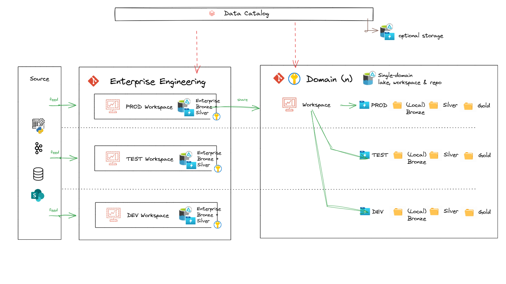

# Level 2 - Domain-Level (Solution) Architecture and Patterns
[Return to home](README.md)

This section shows how the [Enterprise Data Platform Reference Architecture](level_1.md#enterprise-data-platform-reference-architecture) as well as [standards](standards_and_conventions.md) are applied within individual [domains](level_1.md#domain) to create solutions.

<br>
## Why It Matters

Using common patterns and standards at the domain level keeps solutions consistent and compatible. This speeds up delivery, avoids rework, and ensures every solution contributes to and strengthens the overall enterprise “town plan.”

<br>
<br>


## Table of Contents
---

- [Business architecture](level_2.md#business-architecture)
    - [Business processes](level_2.md#business-processes)
    - [Business glossary](level_2.md#business-glossary)
    - [Business metrics](level_2.md#business-metrics)
- [Data Architecture](level_2.md#data-architecture)
    - [Data and information models](level_2.md#data-and-information-models)
    - [Domain glossary](level_2.md#domain-glossary)
    - [Domain data and warehouse models](level_2.md#domain-data-and-warehouse-models)
    - [Data zones and layers](level_2.md#data-zones-and-layers)
    - [Lakehouse Catalog to Storage Mapping](level_2.md#lakehouse-catalog-to-storage-mapping)
- [Data Engineering](level_2.md#data-engineering)
    - [Ingestion](level_2.md#ingestion)
    - [Transformation](level_2.md#transformation)
    - [Data sharing and delivery patterns](level_2.md#data-sharing-and-delivery-patterns)
- [Data governance](level_2.md#data-governance)
    - [Data lifecycle and asset management](level_2.md#data-lifecycle-and-asset-management)
    - [Data access management](level_2.md#data-access-management)
    - [Data quality](level_2.md#data-quality)
    - [Data understandability](level_2.md#data-understandability)
    - [Privacy Preservation](level_2.md#privacy-preservation)
    - [Audit](level_2.md#audit)
- [Infrastructure](level_2.md#infrastructure)
    - [Environments, Workspaces and Storage](level_2.md#environments-workspaces-and-storage)
    - [Secrets](level_2.md#secrets)
    - [Storage](level_2.md#storage)
    - [CICD and Repository](level_2.md#cicd-and-repository)
    - [Observability](level_2.md#observability)
    - [Networking](level_2.md#networking)
    - [Orchestration](level_2.md#orchestration)

<div align="center">

<em>Example Platform and Pipeline Reference Architecture</em>

<a href="../img/logical_platform_and_pipeline_reference_architecture.png" target="_blank">
    
</a>

<br>
</div>

## Business architecture

### Use cases and business requirements
---


Business requirements, use cases, and use case roadmaps together define what a solution must achieve, how it will be applied, and when capabilities will be delivered according to agreed priorities. These priorities may sit at the enterprise, domain level or both.

Understanding them is necessary to understand:

- the outcomes the solution must enable or improve
- the measures of success, constraints, and scope that shape design
- how the solution will be used to meet specific business needs
- the sequence and priority of delivering capabilities to maximise business value


### Business processes
---

Business processes are the activities and tasks undertaken to achieve business goals. Understanding them allows the data architecture to uncover:

- the context in which information is captured and used
- key concepts and entities relevant to the domain or use case
- relationships between processes and data
- the basis for defining measures and metrics

### Business glossary
---

A business glossary is a curated list of terms and definitions relevant to the business (at both the Enterprise and Domain levels). Understanding these terms and how they map across the organisation by stakeholders and systems is critical to consistent understanding and usage of concepts. 

It is core part of [Enterprise Metadata Architecture](level_1.md#enterprise-metadata-architecture).

<div align="center">

<em>Example glossary from Intuitas' Glossary builder tool</em>
<br>
<a href="../img/glossary.png" target="_blank">
    
</a>
<br>

</div>

Contact us at 📧 <a href="mailto:office@intuitas.com">office@intuitas.com</a> to learn more about the tool.

### Business metrics
---

Measures are raw, quantifiable values that capture facts about business activities (e.g., total sales, number of customers).

Metrics are calculated or derived indicators that assess the performance of business processes, often using one or more measures (e.g., sales growth rate, customer churn rate).

Both require capture, at a minimum, of:

- name
- definition
- formula (with reference to concepts and terms as defined in the business glossary)
- associated dimensions
- source(s)
- metric owner
- frequency

<br>
<br>


## Data Architecture
---

Data Architecture defines how data is structured, stored, and accessed. It spans storage design, data models, integration, and governance to ensure trusted, reusable, and consistent data.

### Data and information models
---

- **Conceptual Models** – capture high-level business concepts and rules in plain language, creating a shared understanding between business and IT.
- **Logical Models** – refine concepts into entities, attributes, and relationships, ensuring clarity and consistency across domains while remaining technology-agnostic.
- **Physical Models** – implement the design in databases and systems, optimised for performance, scalability, and integration.

Domain-level models often align more closely to real-world business semantics and rules than the enterprise-wide model. While they may not map one-to-one with enterprise or other domain models, cross-mapping is essential to identify dependencies, ensure conformance (e.g., shared dimensions, master data), and support integration across the organisation.

<br>
<div align="center">

<em>Example of modelling a Domain-scoped Conceptual Information Model</em>
<br>

<a href="../img/snappy_models.png" target="_blank">
    
</a>

<br>
</div>


See [Bounded context](https://martinfowler.com/bliki/BoundedContext.html)

### Domain glossary
---

The Domain Glossary complements the Domain Model by describing concepts in clear business language. It defines domain-specific terms, synonyms, and the context in which they are used, along with properties such as attributes, keys, measures, and metrics.

A well-curated Domain Glossary:

- Ensures clarity, reduces ambiguity, and strengthens alignment between business understanding and technical implementation. 
- Builds on the Enterprise Glossary: Extend the enterprise glossary with domain-specific definitions.
- References when aligned: Where a domain term is synonymous with an enterprise definition, the enterprise glossary should be referenced rather than duplicated.
- Resolves when conflicting: Where definitions diverge or conflict, governance processes must be applied to reconcile differences and ensure consistency.


<br>
<div align="center">

<em>Example of authoring a Domain-scoped Glossary aligned to the CIM and Enterprise Glossary</em>
<br>

<a href="../img/snappy_domain_glossary.png" target="_blank">
    
</a>

<br>
</div>

<br>
<br>
<div align="center">

<em>Example of syncing the Glossary term to real-life Data and Products</em>
<br>

<a href="../img/datahub_domain_glossary_encounter.png" target="_blank">
    
</a>

<br>
</div>


### Domain data and warehouse models
---

- Domain-level data and warehouse models reflect domain-specific scope, requirements and semantics as expressed in models and glossaries.
- Conformed dimensions may serve as a bridge between domains for common entities.

### Data zones and layers
---

Data and analytics pipelines flow through data zones and layers. Conventions vary across organisations, however the following is an effective approach:

* Within each zone, data flows through a series of processing layers.
* Top level zones follow the [Medallion architecture](https://www.databricks.com/glossary/medallion-architecture).

    - **Raw (Bronze): Data according to source.**
    - **EDW (Silver): Data according to business.** ([see Data and information models](level_2.md#data-and-information-models))
    - **Infomart (Gold): Data according to requirements.**

<div align="center">

<em>Data zones and layers</em>
<br>

<a href="../img/data_zones_and_layers.png" target="_blank">
    
</a>

<br>
</div>

These map to naming standards and conventions for [Catalog](standards_and_conventions.md#catalog-naming-and-conventions), [Schemas](standards_and_conventions.md#schema-and-object-conventions) and [dbt](standards_and_conventions.md#dbt).

#### **Metadata layer**

Contains engineering and governance of data managed within the platform. The format of this will vary depending on the choice of engineering and governance toolsets and associated metamodels within the solution as well as across the broader enterprise.  [see Enterprise Metadata Architecture](level_1.md#enterprise-metadata-architecture) 


#### **Raw (Bronze) zone: Data according to source**

The Raw (Bronze) zone stores raw, immutable data as it is ingested from source systems. The choice of persistence level will depend on requirements.

**(Persistent) Landing**

- Initial storage area for raw data from source systems.
- Stores raw events as JSON or CDC/tabular change records.
- Data is maintained in a primarily raw format, with the possibility of adding extra fields that might be useful later, such as for identifying duplicates. These fields could include the source file name and the load date.

    - Partitioned by load date (YYYY/MM/DD/HH)
    - Raw data preserved in original format
    - Append-only immitable data.
    - Schema changes tracked but not enforced

**ODS (Operational Data Store)**

- Current state of source system data with latest changes applied.
    - Maintains latest version of each record
    - Supports merge operations for change data capture (CDC) / De-duplicated
    - Preserves source system relationships

**PDS (Persistent Data Store)**

- Historical storage of all changes over time.
    - Append-only for all changes
    - De-duplicated
    - Supports point-in-time analysis
    - Configurable retention periods
    - As these may be available in landing - may be realised through views over landing *subject to deduplication


#### **EDW (Silver) zone: Data according to business**
The EDW (Silver) zone focuses on transforming raw data into cleaned, enriched, and validated datasets. These datasets are aligned with broadly accepted business standards and models, making them suitable for a range of downstream requirements.

While some interpretations consider EDW (Silver) to be primarily *source-centric*, this blueprint adopts a more flexible approach—allowing for integration and harmonization of assets across multiple data sources.


**EDW (Silver) Staging**

Transformations used to shape source data into standardised, conformed, and fit-for-use Reference Data, Data Vault and Base Information Mart objects.
Staging is source-centric, with a view to progressively align to concept/entity-centric conventions in the EDW Mart.

- Examples of transformations:
    - `01_renamed_and_typed`
    - `02_deduped`
    - `03_cleaned`
    - `04_filtered/split`
    - `05_column_selected`
    - `06_business_validated`
    - `07_desensitised`

**Data Quality**

Data quality test results from checks applied to source data. Further transformation of these results may be applied to shape them into data quality reports.

**Reference Data**

Reference data, being a common asset and provided for broad consumption should be aligned to standards and downstream needs. Historical versioning requirements of reference data may need to be considered.

**EDW (base) Marts**

The term *base* or *edw* is used to distinguish these marts from the product/requirement-specific marts found in the Infomart (Gold) zone. Base marts are designed for broad usability across multiple downstream use cases—for example, a conformed customer dimension.

Marts here are source-agnostic and concept/entity-centric, however source-centric decompositions of these may exist if required by the business.

Mappings of keys may be created to resolve and map system keys to universal surrogate keys or business keys. These can then be reused downstream for integration.

In some scenarios, it may be beneficial to maintain *source-centric* base marts alongside a final *consolidation* (UNION) mart—all conforming to a common logical model. This approach supports decoupled pipelining across multiple sources, improving modularity and maintainability.

These marts may be implemented as **Kimball-style** dimensional models or **denormalized** flat tables, depending on performance and reporting requirements. However, dimensional modelling is generally encouraged for its clarity, reusability, and alignment with analytic workloads.

#### **Infomart (Gold) zone: Data according to requirements**

The Infomart (Gold) zone focuses on delivering business-ready datasets, including aggregations and reporting structures that directly reflect specific business requirements.

In some instances, Infomart assets may be reused across multiple use cases or domains—blurring the line with EDW. While this is not inherently problematic, it is important to consider supportability and scalability to ensure these assets remain trustworthy, maintainable, and accessible over time.

Consider shifting logic left into the EDW (Silver) zone—such as common aggregations, reusable business rules, or conformed dimensions. This improves consistency, reduces duplication, and enables faster development of Infomart zone assets by building on stronger, more standardized foundations.

**Mart Staging**

Transformations used to shape source data into business-ready datasets, aligned to business requirements.

- Examples of Business-specific transformations include:
    - `Pivoting`
    - `Aggregation`
    - `Joining`
    - `Conformance`
    - `Desensitization`

- While dbt best practices use the term *'Intermediates'* as reuseable building blocks for marts, this is considered a form of staging and are hence optional under this blueprint. https://docs.getdbt.com/best-practices/how-we-structure/3-intermediate

**Product (Requirement Specific) Marts **
The term 'business' here is use to distinguish marts in this zone from marts in the EDW (Silver) zone. These marts are designed for a defined requirement. *e.g. sales fact aggregated by region.*

These marts may be Kimball or denormalised flat tables depending on requirements; although Kimball dimensional models are encouraged.

A solution served to the consumption layer is likely to contain a mix of EDW and Infomart objects. e.g:
- edw.dim_customer
- im.fact_sales_aggregated_by_region

<br>
<br>

### Lakehouse Catalog to Storage Mapping
---

Unity catalog objects (catalogs, schemas, objects) are mapped to:

- Storage accounts
- Environments (containers: dev, test, prod)
- Zones (Level 1 folders: dev.raw, dev.edw, dev.infomart, etc)
- Layers (Level 2 folders: dev.raw\landing, dev.raw\ods, dev.edw\stg, dev.edw\mart etc)

<br>

<div align="center">

<em>Illustrative example of Catalog to storage mapping in the Intuitas Demo Environment:</em>
<br>

<a href="../img/catalog_to_storage_mapping.png">
    
</a>

<br>

</div>

## Data Engineering
---

### Ingestion
---

*Note: These patterns and findings reflect GA functionality only as as at the date of publication and research. Refer to respective product roadmaps and documentation for the latest guidance on functionality.*

Ingestion is the process of acquiring data from external sources and landing it in the platform Raw zone landing layer.

It should be:

- Scalable, Resilient, Maintainable, Governed
- Pattern-based, automated and Metadata-driven where possible
- Batch and stream-based

<br>
<br>
<div align="center">

<em>Example batch ingestion options:</em>
<br>

<a href="../img/ingestion_patterns.png" target="_blank">
    
</a>
</div>

#### Ingestion patterns and notes:

<br>

- Pattern 1: streaming: kafka -> landing -> databricks autoloader -> ods
    - see repo [Bronze Landing to ODS Project](https://github.com/bensonchoyintuitas/health_lakehouse__engineering__databricks)

- Pattern 2: batch: source -> adf -> landing -> databricks autoloader merge to ods
    - see repo [Bronze landing SQL Server to ODS Project](https://github.com/bensonchoyintuitas/health_lakehouse__engineering__databricks)
    - adf requires azure sql and on-premise integration runtime

    - see repo [External Database to ODS Project](https://github.com/bensonchoyintuitas/health_lakehouse__engineering__databricks)
    - requires network access to source

- Pattern 4: batch/streaming: source -> custom python -> deltalake -> external table

- Pattern 5: databricks lakeflow: source -> lakeflow connect -> ods
    - requires network access to source

- Pattern 6: sharepoint -> fivetran -> databricks sql warehouse (ods)
    - see repo [fivetran](https://github.com/bensonchoyintuitas/health_lakehouse__engineering__custom)

Rejected patterns:

- batch: adf -> deltalake -> ods (does not support unity catalog, requires target tables to be pre-initialised)
- batch: adf -> databricks sql endpoint -> ods (no linked service for databricks)
- batch: adf + databricks notebook -> landing, ods, pds (more undesireable coupling of adf and databricks an associated risks)

### Transformation
---

> Under development. (Contact us to know more).
#### Batch and Micro-batch SQL transformation
- dbt [see dbt standards](standards_and_conventions.md#dbt)

#### Streaming SQL transformation
> Under development. (Contact us to know more).

#### Non SQL transformation
> Under development. (Contact us to know more).


### Data sharing and delivery patterns
---

*Note: These patterns and findings reflect GA functionality only as as at the date of publication and research. Refer to respective product roadmaps and documentation for the latest guidance on functionality.*

Data can be shared and delivered to consumers through various channels, each differing in:

- Cost
- Functionality
- Scalability
- Security
- Maintainability

The following subsections offer more details about the channels depicted below.

<div align="center">

<em>Sharing and delivery visualisation channels</em>
<br>

<a href="../img/sharing_delivery_visualisation.png" target="_blank">
    
</a>
</div>


#### Pull / direct access
---

#### **Databricks Delta sharing practices**

- Databricks Delta Sharing allows read-only access directly to data (table, view, change feed) in the lakehouse storage account. This allows for the use of the data in external tools such as BI tools, ETL tools, etc. without the need to use a databricks cluster / sql endpoint. 
-Permissions: Delta sharing is a feature of Databricks Unity Catalog that requires enablement and authorised user/group permissions for the feature as well as the shared object.
- Costs: In Delta Sharing, the cost of compute is generally borne by the data consumer, not the data provider. Other costs include storage API calls and data transfer.
- Naming standards and conventions [see naming standards](standards_and_conventions.md#delta-sharing)
- Tightly scope the share as per the principal of least privilege:
    - Share only the necessary data
    - Single purpose, single recipient
    - Granular access control
    - Set an expiry
- Use audit logging to track access and usage
    ```sql
    SELECT *
    FROM system.access.audit
    WHERE 
    action_name LIKE 'deltaSharing%'
    ORDER BY event_time DESC
    LIMIT 100;
    ```
- Limitations:
    - No Row Level Security and Masking support (dynamic views required)

- Reference: [Security Best Practices for Delta Sharing](https://www.databricks.com/blog/2022/08/01/security-best-practices-for-delta-sharing.html)

#### **ADLSGen2 Access to Data**

- Provide direct ADLSGen2 access via Managed Identity, SAS or Account Key
- Note: While technically possible, ADLSGen2 access is not generally recommended for end user consumption as it bypasses the Unity Catalog and associated governance and observabilit controls.
- Example Scenarios: Direct ADLS file sharing might be preferable in certain cases, even when Delta Sharing is available:
    - Unstructured data
    - Large non-delta file transfer
    - Consumers that don't support Delta Sharing

##### **DuckDB Access to Data (via Unity Catalog)**

- Example: DuckDB is a popular open-source SQL engine that can be used to access data in the lakehouse. It can be run on a local machine or in-process in a Databricks cluster.
- Costs: DuckDB data access will incur costs of the underlying compute, storage access, data transfer, etc., similar to Delta Sharing.
- Example Opportunities/Uses:
    - Last mile analysis
    - SQL interface to Delta, Iceberg, Parquet, CSV, etc.
    - dbt compatibility
    - Local execution and storage of queries and data
    - Use as feed visualization tools, e.g., Apache Superset

- See repo [DuckDB](https://github.com/bensonchoyintuitas/health_lakehouse__engineering__custom)

- Limitations:
    - Unity Catalog not yet supported
    - Delta Kernel not yet supported

#### **SQL Access**
---
- SQL Access is provided by the Databricks SQL (serverless) endpoint.

#### **API Access**
---
> Under development. (Contact us to know more).

- The Databricks SQL Statement Execution API can be used to execute SQL statements on a SQL warehouse and fetch the result.

References:

 - https://docs.databricks.com/api/workspace/statementexecution
 - https://docs.databricks.com/en/dev-tools/sql-execution-tutorial.html

#### **Snowflake Access**
---

- Snowflake access is provided by Databricks Delta Sharing.
- Snowflake access is also provided by Databricks Delta Lake external tables over ADLSGen2 [see external tables](https://docs.snowflake.com/en/sql-reference/sql/create-iceberg-table-delta)

References:
- [tutorial](https://harke-harkema.medium.com/reading-delta-tables-in-snowflake-1396d21bf970)


#### **Microsoft Fabric Access**
---

The following describes options for providing access to Microsoft Fabric / PowerBI 

*Option 1. Share via Delta Sharing*

Steps:

1. Create a delta share
2. Use the delta share to import from within PowerBI

Evaluation:

- Pros: 
    - No duplication
    - Centralised control over access policies
    - Compute costs on consumer 
    - Avoided SQL Endpoint costs for reads
- Cons: 
    - Row Level Security and Masking support via dynamic views only
    - See [limitations](https://learn.microsoft.com/en-au/azure/databricks/partners/bi/power-bi). e.g. The data that the Delta Sharing connector loads must fit into the memory of your machine. To ensure this, the connector limits the number of imported rows to the Row Limit that was set earlier.

*Option 2. Directlake via ADLSGen2*

Steps:

1. Create a new connection to ADLSGen2 using a provided credential / token / Service principal
2. Create a lakehouse shortcut in Fabric

Evaluation:

- Pros: 
    - No duplication
    - Potentially better PowerBI performance (untested)
    - Compute costs on consumer 
    - No views
- Cons: 
    - Less control over access policies than Delta Sharing (outside of Unity Catalog)
    - Requires granular ADLSGen2 access controls and service principals, and associated management overhead
    - No Row Level Security and Masking support 
    - May require OneLake

*Option 3. Fabric mirrored unity catalog*

Steps:

1. Within a Fabric Workspace, create a new item `Mirrored Azure Databricks Catalog`
2. Enter the Databricks workspace config to create a new connection

Evaluation:

- Pros: 
    - No duplication
    - Convenient access to all Databricks Unity Catalog objects (within credential permissions)
- Cons: 
    - not GA or tested
    - service-principal level identity required to enforce permissions
    - Requires public workspaces


*Option 4. PowerBI Import Via SQL Endpoint*

Steps:

[Databricks documentation](https://learn.microsoft.com/en-au/azure/databricks/partners/bi/power-bi)

Evaluation:

- Pros: 
    - Potentially the best PowerBI performance and feature completeness
    - Predictable costs on Databricks
- Cons: 
    - Some, but manageable Compute costs on Databricks

*Option 5. PowerBI DirectQuery Via SQL Endpoint*

Steps:

[Databricks documentation](https://learn.microsoft.com/en-au/azure/databricks/partners/bi/power-bi)

Evaluation:

- Pros: 
    - No duplication
    - Unity Catalog Enforced Row Level Security and Masking 

- Cons: 
    - High Compute costs on Databricks on every report interaction
    - Likely deprecated in favour of DirectLake
    - Less feature rich that import mode

*Option 6. Replicate into Fabric*

- Pros:
    - Possibly reduced networking costs (depending on workload and networking topology)

- Cons: 
    - Duplicated data
    - Engineering costs and overheads
    - Latency in data updates (SQL Endpoint lag)
    - Less governance control compared to Unity Catalog
    - No Row Level Security and Masking support 
    - Requires use of Onelake and associated CU consumption

#### Push
---

> Under development. (Contact us to know more).

Areas for consideration include:

- adf
- databricks
- lakeflow

### Visualisation
---
> Under development. (Contact us to know more).

Areas for consideration include:

- Powerbi
- Databricks dashboards
- Apps
- Open source visual options 

<br>

## AI/ML

> Under development. (Contact us to know more).

Areas for consideration include:

- MLOps
- Training
- Databricks
- Azure ML

<br>

## Data governance

This section describes how Enterprise-level governance will be implemented through solutions at the domain level.

### Data lifecycle and asset management
---
> Under development. (Contact us to know more).

Areas for consideration include:

- data contracts and policy
- data asset tagging


### Data access management
---
> Under development. (Contact us to know more).

Areas for consideration include:

- data access request management
- data contracts
- access audit
- activity audit


### Data quality
---
> Under development. (Contact us to know more).

Areas for consideration include:

- data quality checking and reporting
- data standards and quality business rule management


### Data understandability
---
> Under development. (Contact us to know more).

Areas for consideration include:

- data lineage
- data object metadata


### Privacy Preservation 
---
> Under development. (Contact us to know more).

Areas for consideration include:

- row level security
- data masking
- column level security
- data anonymisation
- data de-identification

https://docs.databricks.com/en/tables/row-and-column-filters.html#limitations

"If you want to filter data when you share it using Delta Sharing, you must use dynamic views."

Use dynamic views if you need to apply transformation logic, such as filters and masks, to read-only tables and if it is acceptable for users to refer to the dynamic views using different names.

#### Row Level Security
---
> Under development. (Contact us to know more).

Areas for consideration include:

- dynamic views
- precomputed views
- costs and overheads of various patterns of sharing of RLS-applied data

#### Audit
---

> Under development. (Contact us to know more).

Areas for consideration include:

- audit log queries

##### Typical observability requirements by role

**As a Domain (workspace) Admin**
```md
1. Where are there misconfigured catalogs / schemas / objects?
2. Who is sharing what to who and is that permitted (as per access approvals?)
3. Who is accessing data and are they permitted (as per access approvals?)
```
<br>
<br>


## Infrastructure
---
> Under development. (Contact us to know more).
### Environments, Workspaces and Storage

<div align="center">

<em>Workspaces, Environments and Storage</em>
<br>

<a href="../img/workspaces_environments_storage.png" target="_blank">
    
</a>

</div>
This diagram illustrates a **data lakehouse architecture** with the following components and flow:


**Data Sources**

Data originates from multiple sources such as:
  - Databases
  - Kafka or event streaming
  - APIs or Python scripts
  - SharePoint (or similar sources)


**Enterprise Engineering Layer**

- Centralized enterprise workspaces are managed here with multiple environments. 
While work can be achieved within a single workspace and lakehouse storage account, decoupling the workspaces and storage accounts allow for more isolated change at the infrastructure level - in line with engineering requirements:
- Each workspace contains:
- Data from prod catalogs can be **shared** to other domains.


**Domain-Specific Layer**

- Each domain (e.g., business units or specific applications) operates independently within a single workspace that houses multiple environments. 
- **PROD**, **TEST**, and **DEV** storage containers within a single lakehouse storage account for domain-specific data management.
- Local **Raw (Bronze)** for domain-specific engineering of domain-local data (not managed by enterprise engineering)
- Data from prod catalogs can be **shared** to other domains.

**Data Catalog**

- A centralized data catalog (unity catalog) serves as a metadata repository for the entire architecture:
- Enables discovery and governance of data.
- Optional external catalog storage.


### Secrets

---
> Under development. (Contact us to know more).

Areas for consideration include:

- Management
- Areas of use
- Handling practices

### Storage
---

#### Lakehouse storage

Lakehouse data for all environments and zones, by default, share a single storage account with LRS or GRS redundancy.
This can then be modified according to costs, requirements, policies, projected workload and resource limits from both Azure and Databricks.

- Resource: ADLSGen2
- Tier: Standard/Premium (depends on workload)
- Redundancy: 
   - Minimum ZRS or GRS for prod
   - Minimum LRS for poc, dev, test and preprod


#### Generic Blob storage

Generic Blob storage can be used for all non-lakehouse data; or alternatively within the lakehouse storage account in the appropriate container and folder.

- Resource: ADLSGen2
- Generic storage account name: sa{organisation_name}{domain_name}{functional_description}
- Tier: Standard/Premium (depends on workload)
- Redundancy: 
   - Minimum ZRS or GRS for prod
   - Minimum LRS for poc, dev, test and preprod

### CICD and Repository
---
> Under development. (Contact us to know more).

Areas for consideration include:

- Description of git workflows for CICD in terms of:

    - Infrastructure
    - Data engineering
    - Analytics engineering
    - Data science / AIML
    - BI, Reports and other products

#### Tools
> Under development. (Contact us to know more).

Areas for consideration include:

- Github
- Azure Devops
- Databricks Asset Bundles

#### Repositories
> Under development. (Contact us to know more).

Areas for consideration include:

- Infrastructure IAC repos (Terraform)
- dbt projects (separate for each domain)
    - potential for enterprise level stitching of lineage
- Data engineering code (separate for each domain) using Databricks Asset Bundles

### Observability
---

Tools included in reference architecture:

- dbt observability - Elementary
- Databricks observability - Databricks monitoring dashboards
- ADF - Native adf monitoring

#### dbt observability - Elementary

Elementary is a dbt observability tool available in both Open Source and Cloud Service forms. For more information, visit: <a href="https://docs.elementary-data.com/introduction" target="_blank">Elementary Documentation</a>

<div align="center">

<em>dbt warehouse observability</em>
<br>

<a href="../img/observability.png" target="_blank">
    
</a>

<br>
<br>
<a href="https://dlintuitasweb.z8.web.core.windows.net/index.html#/report/dashboard" target="_blank">Example observability dashboard for Intuitas Engineering Domain</a>

</div>

Elementary acts as a health monitor and quality checker for dbt projects by automatically tracking, alerting, and reporting on:

- Data freshness: Ensures your data is up to date.
- Volume anomalies: Detects unexpected changes in row counts.
- Schema changes: Monitors additions, deletions, or modifications of columns.
- Test results: Checks if your dbt tests are passing or failing.
- Custom metrics: Allows you to define your own checks.

It leverages dbt artifacts (such as run results and sources) to send alerts to Slack, email, or other tools. Additionally, it can automatically generate reports after dbt runs, enabling early detection of issues without manual intervention.


### Networking
---

Areas for consideration include:

- By default - all resources reside within the same VNet with private endpoints.
- Service endpoints and policies can be enabled - however consider impacts on private endpoints.


### Orchestration
---
> Under development. (Contact us to know more).

#### Tools included in reference architecture

- Azure Data Factory (if needed)
- Databricks Workflows (for both databricks and dbt)

### Security
---
> Under development. (Contact us to know more).

#### Tools included in reference architecture

- Azure Entra
- Azure Key Vault
- Unity Catalog 
    - System access reports
