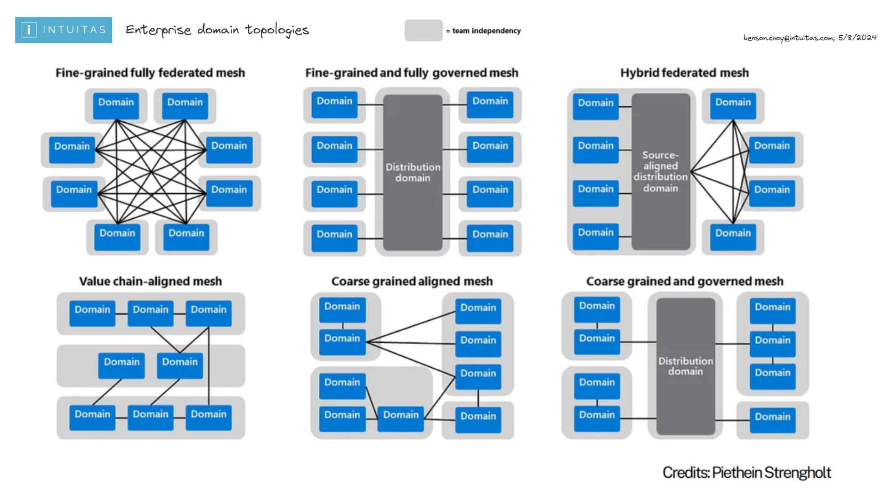
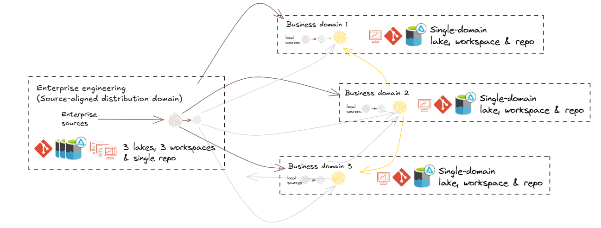

# Level 1 - Enterprise-Level 
[Return to home](README.md)

# Table of Contents

- [Enterprise Domain Topology](#enterprise-domain-topology)
    - [Key concepts](#key-concepts)
        - [Domain](#domain)
        - [Subdomain](#subdomain)
        - [Domain-Centric Design](#domain-centric-design) 
        - [Data Mesh](#data-mesh)
        - [Domain Topology](#domain-topology)
        - [Data Fabric](#data-fabric)
        - [Data Mesh vs Fabric](#data-mesh-vs-fabric)
    - [Reference topologies](#reference-topologies)
    - [Hybrid federated mesh topology](#hybrid-federated-mesh-topology)

- [Enterprise Data Platform Reference Architecture](#enterprise-data-platform-reference-architecture)

- [Enterprise (Logical) Data Warehouse Reference Architecture](#enterprise-logical-data-warehouse-reference-architecture)
    - [Logical Data Warehouse topology](#logical-data-warehouse-topology)

- [Enterprise Information and Data Architecture](#enterprise-information-and-data-architecture)

- [Enterprise Metadata Architecture](#enterprise-metadata-architecture)
    - [Databricks Unity Catalog Metastore](#databricks-unity-catalog-metastore)

- [Enterprise Security](#enterprise-security)

### Key concepts

**Domain**: 

Domains relate to functional and organisational boundaries, and represent closely related areas of responsibility and focus.

- Each domain encapsulates functional responsibilities, services, processes, information, expertise, and governance.
- Domains serve their own objectives while also offering products and services of value to other domains and the broader enterprise.
- Our use of this term draws inspiration from Domain-Driven Design and Data Mesh principles.

see [Domain driven design](https://martinfowler.com/bliki/DomainDrivenDesign.html)

 **Subdomain**: 

A subdomain is a lower-level domain within a parent domain that groups data and capability related to a specific business or function area.

**Domain-Centric Design**: 

Using domains as logical governance boundaries helps ensure data ownership and accountability. This approach aligns with the data mesh principle of decentralizing data management and providing domain teams with autonomy.

**Data Mesh**: 

A data mesh is a decentralized approach to data management that empowers domain teams to own their data and build data products. The then shares data as products with other domains. It emphasizes autonomy, flexibility, and interoperability. This approach is not necessarily appropriate for all organisations. It can be described through 4 principles which organisations will embody with varying degrees of maturity and success:
- **Data as a Product**: Data is treated as a valuable asset that can be bought, sold, and managed like any other product.
- **Self-Serve Data Consumers**: Data consumers have the autonomy to access and use data without relying on IT support.
- **Data as a Service**: Data is delivered as a service, allowing for flexible and scalable access to data.
- **Domain-Driven Governance**: Data is governed by domain experts, ensuring alignment with business objectives and data quality.

see [Data Mesh: Principles](https://martinfowler.com/articles/data-mesh-principles.html)

**Domain Topology**: 

A Domain Topology is a representation of how domains are structured, positioned in the enterprise, and how they interact with each other. see [Data Mesh: Topologies and domain granularity](https://towardsdatascience.com/data-mesh-topologies-and-domain-granularity-65290a4ebb90?gi=631b1b9f4dbb)

**Data Fabric**: 

A data fabric is a unified platform that integrates data from various sources and provides a single source of truth. It enables data sharing and collaboration across domains and supports data mesh principles.

**Data Mesh vs Fabric**: 

A data mesh and fabric are not mutually exclusive. In fact, they can be complementary approaches. A data mesh can be built on top of a data fabric.

### Reference topologies

- Organisations need to consider the current and target topology that best reflects their strategy, capabilities, structure and operating/service model.
- The arrangement of domains:
    - reflects its operating model 
    - defines expectations on how data+products are shared, built, managed and governed
    - impacts accessibility, costs, support and overall experience.

 
 
 

### Hybrid federated mesh topology

**Hybrid of Data Fabric and Data Mesh:**
- Combines centralised governance with domain-specific autonomy.
- Offers a unified platform for seamless data integration, alongside domain-driven flexibility.

**Fabric-Like Features:**
- Scalable, unified platform: Connects diverse data sources across the organisation.
- Shared infrastructure and standards: Ensures consistency, interoperability, and trusted data.
- Streamlined access: Simplifies workflows and reduces friction for data usage and insights delivery.

**Mesh-Like Features:**
- Domain-driven autonomy: Empowers teams to create tailored solutions for their specific data and AI needs.
- Collaboration-focused: Teams act as both data producers and consumers, fostering reuse and efficiency.
- Federated governance: Ensures standards while allowing teams to manage their data locally.

Hybrid federated mesh topology reflects a common scenario whereby centralisation occurs upstream for improved consolidation and standardisation around engineering, while federation occurs downstream for improved analytical flexibility and responsiveness. 

**Centralising engineering**

Centralizing engineering tasks related to source data processing allows for specialized teams to efficiently manage data ingestion, quality checks, and initial transformations. This specialization ensures consistency and reliability across the organization.

**Distributed Local engineering**
Maintaining a local bronze layer for non-enterprise-distributed data enables domains to handle their specific raw data requirements, supporting use cases that are not yet enterprise-wide.

**Cross-Domain Access**
Allowing domains to access gold data from other domains and, where appropriate, silver or bronze, facilitates reuse, cross-domain analytics and collaboration, ensuring data mesh interoperability.

## Enterprise Data Platform Reference Architecture
Describes the logical components (including infrastructure, applications and common services) that make up a default data and analytics solution, offered and supported by the enterprise. This artefact can then be used as the basis of developing domain-specific overlays.

Example:

 
 

## Enterprise (Logical) Data Warehouse Reference Architecture

**Logical Data Warehouse topology**

- Reflects the domain topology.
- Provides unified access to data warehouse products from across domains via a common catalog.

Example:

## Enterprise Information and Data Architecture

Solutions such as data warehouses and marts should reflect the business semantics relating to the scope of requirements, and will also need to consider:
- Existing enterprise information, conceptual and logical models
- Legacy warehouse models
- Domain information models and glossaries
- Domain business objects and process models
- Common entities and synonyms (which may form the basis of conformed dimensions)
- Data standards

Other secondary considerations:
- Source system data models
- Industry models
- Integration models

## Enterprise Metadata Architecture

- Description of applicable metadata standards
- Enterprise Metadata Architecture and Metamodel
- Description of metadata governance, stewards and processes

### Databricks Unity Catalog Metastore

- Only one metastore exists per region
[Documentation](https://learn.microsoft.com/en-us/azure/databricks/data-governance/unity-catalog/create-metastore#add-storage)

- Metastore-level storage accounts are used to store the metastore and its associated data. 
- Recommendation:
    - [Databricks recommends](https://docs.databricks.com/en/connect/unity-catalog/cloud-storage/managed-storage.html) that you assign managed storage at the catalog level for logical data isolation, with metastore-level and schema-level as options.

## Enterprise Security

- Description of security policies and standards for both the organisation and industry
- Description of processes, tools, controls, protocols to adhere to during design, deployment and operation.
- Description of responsibilities and accountabilities.
- Risk and issues register
