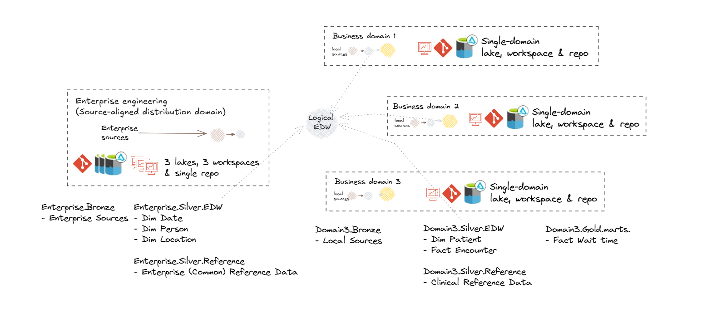

## Level 1 - Enterprise-Level 
[Return to home](README.md)

### 1.1 Enterprise Domain Topology

#### **1.1.1 Key concepts**

- **Domain-Centric Design**: Using domains as logical governance boundaries helps ensure data ownership and accountability. This approach aligns with the data mesh principle of decentralizing data management and providing domain teams with autonomy.
- **Data Mesh**: A data mesh is a decentralized approach to data management that empowers domain teams to own their data and build data products. The then shares data as products with other domains. It emphasizes autonomy, flexibility, and interoperability. This approach is not necessarily appropriate for all organisations. It can be described through 4 principles which organisations will embody with varying degrees of maturity and success:
    - **Data as a Product**: Data is treated as a valuable asset that can be bought, sold, and managed like any other product.
    - **Self-Serve Data Consumers**: Data consumers have the autonomy to access and use data without relying on IT support.
    - **Data as a Service**: Data is delivered as a service, allowing for flexible and scalable access to data.
    - **Domain-Driven Governance**: Data is governed by domain experts, ensuring alignment with business objectives and data quality.

- **Data Fabric**: A data fabric is a unified platform that integrates data from various sources and provides a single source of truth. It enables data sharing and collaboration across domains and supports data mesh principles.
- **Data Mesh vs Fabric**: A data mesh and fabric are not mutually exclusive. In fact, they can be complementary approaches. A data mesh can be built on top of a data fabric.

#### **1.1.2 Reference topologies**

Organisations need to consider the current and target topology that best reflects their strategy, capabilities, structure and operating/service model.

 
 
 

#### **1.1.2 Hybrid federated mesh topology**

Hybrid federated mesh topology reflects a common scenario whereby centralisation occurs upstream for improved consolidation and standardisation around engineering, while federation occurs downstream for improved analytical flexibility and responsiveness. All domains operate under a common governance framework and architectural standards where there are cross-dependencies.

**Centralizing engineering**

Centralizing engineering tasks related to source data processing allows for specialized teams to efficiently manage data ingestion, quality checks, and initial transformations. This specialization ensures consistency and reliability across the organization.

**Silver Maintenance**

Managing the silver layer can be context-dependent:

The engineering domain can provide standardised common data transformations (non business domain specific/enterprise), while 

Business domains apply their business domain-specific logic and customisations (e.g. enrichment) in the silver layer. This balances consistency with flexibility and leverages the strengths of both types of domains.

Business domains may be a mix of course and fine-grained:
- Core (if existing in business, but not within Engineering)
- Clinical_[subdomain 1,2,3]
- Corporate_[subdomain 1,2,3]

Local Bronze Storage: 
Maintaining a local bronze layer for non-enterprise-distributed data enables domains to handle their specific raw data requirements, supporting use cases that are not yet enterprise-wide.

Cross-Domain Access: 
Allowing domains to access gold data from other domains and, where necessary, silver or bronze, facilitates cross-domain analytics and collaboration, ensuring data mesh interoperability.

### 1.2 Enterprise Data Platform Reference Architecture

### 1.3 Enterprise (Logical) Data Warehouse Reference Architecture

**Logical Data Warehouse**
Provides access to data warehouse products from across data domains.

### 1.4 Enterprise Metadata Architecture
### 1.5 Enterprise Information and Data Architecture
### 1.6 Enterprise Security
