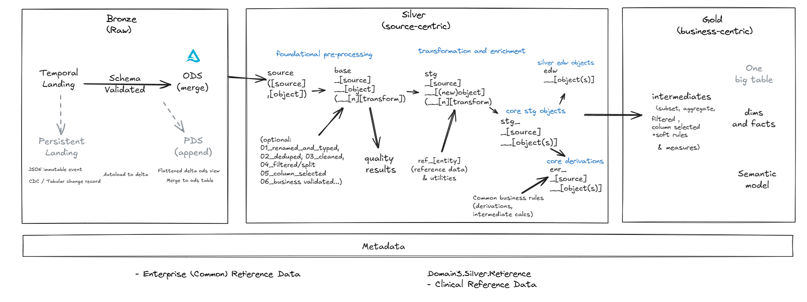

# Level 2 - Domain-Level (Solution) Architecture and Patterns
[Return to home](README.md)

Domain-level solutions are instantiations of the enterprise-level reference architecture. (See [1.2 Enterprise Data Platform Reference Architecture](level_1.md#1.2))

Example:

## 2.1 Infrastructure
### 2.1.1 Environments, Workspaces + Clusters
### 2.1.2 Secrets
### 2.1.3 Storage
### 2.1.4 CICD + Repository
### 2.1.5 Observability
### 2.1.6 Networking
### 2.1.7 Orchestration

## 2.2 Data and information models

Domain-level data and information models are typically closer aligned to real-world business semantics and business rules, which may not necessarily align with the broader enterprise or other domains. 

See [Bounded context](https://martinfowler.com/bliki/BoundedContext.html)

### 2.2.1 Domain glossary
- Expand on the enterprise glossary and add domain specific terms and definitions.
    - In cases where domain definitions are synonymous with enterprise definitions, the enterprise glossary should be referenced.
    - In cases where definitions are conflicting, governance should be applied to resolve the conflict.

### 2.2.2 Domain data and warehouse models
- Domain-level data and warehouse models reflect domain-specific scope, requirements and semantics as expressed in models and glossaries.
- Conformed dimensions may serve as a bridge between domains for common entities.

## 2.3 Data Architecture

### 2.3.1 Data zones and stages 

Data and analytics pipelines flow through data zones and stages. Conventions vary across organisations, however the following is an effective approach:

* Top level zones follow the [Medallion architecture](https://www.databricks.com/glossary/medallion-architecture).
* Within each zone, data is transformed through a series of stages.
 
 

 
 

#### **Metadata**

Contains metadata that supports engineering and governance. This will vary depending on engineering and governance toolsets

#### **Bronze**

The Bronze layer stores raw, immutable data as it is ingested from source systems.

*(Persistent) Landing*

- Initial storage area for raw data from source systems.
- Stores raw events as JSON or CDC/tabular change records.
- Data is maintained in a primarily raw format, with the possibility of adding extra fields that might be useful later, such as for identifying duplicates. These fields could include the source file name and the load date.

    - Partitioned by load date (YYYY/MM/DD/HH)
    - Raw data preserved in original format
    - Append-only immitable data.
    - Schema changes tracked but not enforced

*ODS (Operational Data Store)*

- Current state of source system data with latest changes applied.
    - Maintains latest version of each record
    - Supports merge operations for change data capture (CDC)
    - Preserves source system relationships

*PDS (Persistent Data Store)*

- Historical storage of all changes over time.
    - Append-only for all changes
    - Supports point-in-time analysis
    - Configurable retention periods
    - As these may be available in landing - may be realised through views over landing

#### **Silver**
The Silver layer is source centric and focuses on transforming raw data into cleaned, enriched, and validated datasets.

*Base Models*

- Representation of source data with no changes. Used as a foundation for staging models as well as data quality checks.

*Staging Models*

- Source-system and object centric transformations that are core to all downstream consumption.

- Examples of transformations:
    - `01_renamed_and_typed`
    - `02_deduped`
    - `03_cleaned`
    - `04_filtered/split`
    - `05_column_selected`
    - `06_business_validated`
    - `07_desensitised`

*Enrichment Models*

Still source-centric, however:
- more complex business logic and transformations are applied e.g. common calculations and derivations. 
- may combine multiple staging objects from the same source

- By separating enrichment from core staging, we can schedule these processes independently. This allows for flexibility in updating or refreshing only the parts of the data pipeline that need it, reducing unnecessary computation and improving efficiency. It also allows for change and versioning of those business rules with minimal impact on core staging objects.

*Source Reference Data*

- For convenience, reference data specific to the source can be segregated here and aligned to standards and downstream needs.

*Raw Vault*

- Data vault 2.0 aligned raw data warehouse.

#### **Gold**

The Gold layer focuses on business-ready datasets, aggregations, and reporting structures.

*Business Vault*

- Data vault 2.0 aligned business data warehouse where business rules and transformations are applied.

*Intermediate Models*

- These act as building blocks for marts, transforming and aggregating data further. Then be thought of as mart staging  https://docs.getdbt.com/best-practices/how-we-structure/3-intermediate

- Business-specific transformations such as:
    - Pivoting
    - Aggregation
    - Joining
    - Funnel creation
    - Conformance
    - Desensitization

*Enterprise Reference Data*

- Reference data, independent of source can be aggregated here for broad consumption.

*Marts - Facts and dimensions*

- Kimball style marts that represent business entities and processes. They may 
    * serve foundational or narrow requirements. 
    * be scoped to specific systems or conformed across the enterprise

*Marts - Denormalised*

- Single table / view objects that combine data from multiple objects (e.g. facts and dimensions) 

### 2.3.2 Lakehouse Catalog to Storage Mapping

Unity catalog objects (catalogs, schemas, objects) are mapped to:
- Storage accounts
- Environments (containers: dev, test, prod)
- Zones (Level 1 folders: dev.bronze, dev.silver, dev.gold, etc)
- Stages (Level 2 folders: dev.bronze\landing, dev.bronze\ods, dev.silver\base, dev.silver\staging etc)

 
 
Example:

 
 

## 2.4 Data Engineering
### 2.4.1 Ingestion

Ingestion is the process of acquiring data from external sources and landing it in the platform landing zone.

It should be:
- Scalable, Resilient, Maintainable, Governed
- Pattern-based, automated and Metadata-driven where possible
- Batch and stream-based

 
 
Example batch ingestion options:

 
 

#### Pattern specific notes:

Pattern 1: SQL Server source -> ADF -> Landing | Databricks Autoloader merge to ODS

Rejected patterns:
1. ADF -> Deltalake (does not support unity catalog)

### 2.4.2 Transformation
- [dbt standards](dbt_standards.md)
### 2.4.3 Delivery

### 2.5 Data access and governance

