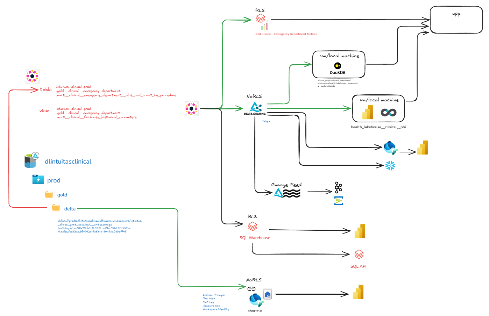

# Level 2 - Domain-Level (Solution) Architecture and Patterns
[Return to home](README.md)

## Table of Contents
- [Business architecture](level_2.md#business-architecture)
    - [Business processes](level_2.md#business-processes)
    - [Business glossary](level_2.md#business-glossary)
    - [Business metrics](level_2.md#business-metrics)

- [Infrastructure](level_2.md#infrastructure)
    - [Environments, Workspaces + Clusters](level_2.md#environments-workspaces-clusters)
    - [Secrets](level_2.md#secrets)
    - [Storage](level_2.md#storage)
    - [CICD + Repository](level_2.md#cicd-repository)
    - [Observability](level_2.md#observability)
    - [Networking](level_2.md#networking)
    - [Orchestration](level_2.md#orchestration)

- [Data and information models](level_2.md#data-and-information-models)
    - [Domain glossary](level_2.md#domain-glossary)
    - [Domain data and warehouse models](level_2.md#domain-data-warehouse-models)

- [Data Architecture](level_2.md#data-architecture)
    - [Data layers and stages](level_2.md#data-layers-stages)
    - [Lakehouse Catalog to Storage Mapping](level_2.md#lakehouse-catalog-storage-mapping)

- [Data Engineering](level_2.md#data-engineering)
    - [Ingestion](level_2.md#ingestion)
    - [Transformation](level_2.md#transformation)
    - [Data Sharing and Delivery Patterns](level_2.md#data-sharing-and-delivery-patterns)

- [Data access and governance](level_2.md#data-access-governance)


Domain-level solutions are instantiations of the enterprise-level reference architecture. (See [1.2 Enterprise Data Platform Reference Architecture](level_1.md#1.2))

Example reference architecture:

<a href="images/logical_platform_and_pipeline_reference_architecture.png" target="_blank">
    
</a>

## Business architecture
### Business processes
---
Business processes are the activities and tasks that are performed to achieve the goals of the business.
Understanding them is necessary to understand:
- the context in which data is captured and used
- concepts and entities that are relevant to the domain
- the relationships between different processes and data

### Business glossary
---

A business glossary is a list of terms and definitions that are relevant to the business. see Domain Glossary.

### Business metrics
---
Metrics are the measurements of the performance of the business processes. They should be documented according to a defined template that captures, at a minimum, the following:
- name
- definition
- formula (with reference to data elements and definitions in the business glossary)
- dimensions
- source(s)
- metric owner
- frequency

## Infrastructure
> This section is a work in progress
### Environments, Workspaces + Storage
<a href="images/workspaces_environments_storage.png" target="_blank">
    
</a>
<br>
<br>

This diagram illustrates a **data lakehouse architecture** with the following components and flow:


**Data Sources**
- Data originates from multiple sources such as:
  - Databases
  - Kafka or event streaming
  - APIs or Python scripts
  - SharePoint (or similar sources)


**Enterprise Engineering Layer**
- Centralized enterprise workspaces are managed here with multiple environments. 
While work can be achieved within a single workspace and lakehouse storage account, decoupling the workspaces and storage accounts allow for more isolated change at the infrastructure level - in line with engineering requirements:
- Each workspace contains:
- Data from prod catalogs can be **shared** to other domains.


**Domain-Specific Layer**
- Each domain (e.g., business units or specific applications) operates independently within a single workspace that houses multiple environments. **PROD**, **TEST**, and **DEV** storage containers within a single lakehouse storage account for domain-specific data management.
  - Local **Bronze** for domain-specific engineering of domain-local data (not managed by enterprise engineering)
- Data from prod catalogs can be **shared** to other domains.

**Data Catalog**
- A centralized data catalog (unity catalog) serves as a metadata repository for the entire architecture:
  - Enables discovery and governance of data.
- Optional external catalog storage.


### Secrets
---
> This section is a work in progress
- Management
- Areas of use

### Storage
---

#### Lakehouse storage

Lakehouse data for all environments and layers, by default, share a single storage account with LRS or GRS redundancy.
This can then be modified according to costs, requirements, policies, projected workload and resource limits from both Azure and Databricks.

- Resource: ADLSGen2
- Tier: Standard/Premium (depends on workload)
- Redundancy: 
   - Minimum ZRS or GRS for prod
   - Minimum LRS for poc, dev, test and preprod


#### Generic Blob storage

Generic Blob storage can be used for all non-lakehouse data; or alternatively within the lakehouse storage account in the appropriate container and folder.

- Resource: ADLSGen2
- Generic storage account name: sa{organisation_name}{domain_name}{functional_description}
- Tier: Standard/Premium (depends on workload)
- Redundancy: 
   - Minimum ZRS or GRS for prod
   - Minimum LRS for poc, dev, test and preprod

### CICD + Repository
---
> This section is a work in progress

#### Tools
- Github
- Azure Devops

#### Repositories

- Infrastructure
- dbt projects (separate for each domain)
- Data engineering code (separate for each domain) using Databricks Asset Bundles

### Observability
---

#### Tools

- dbt observability - Elementary
- Databricks observability - Databricks monitoring dashboards
- ADF - Native adf monitoring

### Networking
---
By default - all resources reside within the same VNet with private endpoints.

Service endpoints and policies are enabled.

### Orchestration
---

#### Tools

- Azure Data Factory (if needed)
- Databricks Workflows (for both databricks and dbt)

### Security
---

#### Tools

- Azure Entra
- Azure Key Vault
- Unity Catalog 
    - System access reports

## Data and information models

Domain-level data and information models are typically closer aligned to real-world business semantics and business rules, which may not necessarily align with the broader enterprise or other domains. 

See [Bounded context](https://martinfowler.com/bliki/BoundedContext.html)

### Domain glossary
- Expand on the enterprise glossary and add domain specific terms and definitions.
    - In cases where domain definitions are synonymous with enterprise definitions, the enterprise glossary should be referenced.
    - In cases where definitions are conflicting, governance should be applied to resolve the conflict.

### Domain data and warehouse models
- Domain-level data and warehouse models reflect domain-specific scope, requirements and semantics as expressed in models and glossaries.
- Conformed dimensions may serve as a bridge between domains for common entities.


## Data Architecture

### Data layers and stages 
---

Data and analytics pipelines flow through data layers and stages. Conventions vary across organisations, however the following is an effective approach:

* Top level layers follow the [Medallion architecture](https://www.databricks.com/glossary/medallion-architecture).
* Within each layer, data is transformed through a series of stages.
<br>
<br>
<a href="images/data_layers_and_stages.png" target="_blank">
    
</a>
<br>
<br>

#### **Metadata**

Contains metadata that supports engineering and governance. This will vary depending on engineering and governance toolsets


#### **Bronze**

The Bronze layer stores raw, immutable data as it is ingested from source systems.

*(Persistent) Landing*

- Initial storage area for raw data from source systems.
- Stores raw events as JSON or CDC/tabular change records.
- Data is maintained in a primarily raw format, with the possibility of adding extra fields that might be useful later, such as for identifying duplicates. These fields could include the source file name and the load date.

    - Partitioned by load date (YYYY/MM/DD/HH)
    - Raw data preserved in original format
    - Append-only immitable data.
    - Schema changes tracked but not enforced

*ODS (Operational Data Store)*

- Current state of source system data with latest changes applied.
    - Maintains latest version of each record
    - Supports merge operations for change data capture (CDC)
    - Preserves source system relationships

*PDS (Persistent Data Store)*

- Historical storage of all changes over time.
    - Append-only for all changes
    - Supports point-in-time analysis
    - Configurable retention periods
    - As these may be available in landing - may be realised through views over landing


#### **Silver**
The Silver layer is source centric and focuses on transforming raw data into cleaned, enriched, and validated datasets.

*Base Models*

- Representation of source data with no changes. Used as a foundation for staging models as well as data quality checks.


*Staging Models*

- Source-system and object centric transformations that are core to all downstream consumption.

- Examples of transformations:
    - `01_renamed_and_typed`
    - `02_deduped`
    - `03_cleaned`
    - `04_filtered/split`
    - `05_column_selected`
    - `06_business_validated`
    - `07_desensitised`

*Enrichment Models*

Still source-centric, however:
- more complex business logic and transformations are applied e.g. common calculations and derivations. 
- may combine multiple staging objects from the same source

- By separating enrichment from core staging, we can schedule these processes independently. This allows for flexibility in updating or refreshing only the parts of the data pipeline that need it, reducing unnecessary computation and improving efficiency. It also allows for change and versioning of those business rules with minimal impact on core staging objects.

*Source Reference Data*

- For convenience, reference data specific to the source can be segregated here and aligned to standards and downstream needs.

*Raw Vault*

- Data vault 2.0 aligned raw data warehouse.

#### **Gold**

The Gold layer focuses on business-ready datasets, aggregations, and reporting structures.

*Business Vault*

- Data vault 2.0 aligned business data warehouse where business rules and transformations are applied.

*Intermediate Models*

- These act as building blocks for marts, transforming and aggregating data further. Then be thought of as mart staging  https://docs.getdbt.com/best-practices/how-we-structure/3-intermediate

- Business-specific transformations such as:
    - Pivoting
    - Aggregation
    - Joining
    - Funnel creation
    - Conformance
    - Desensitization

*Enterprise Reference Data*

- Reference data, independent of source can be aggregated here for broad consumption.

*Marts - Facts and dimensions*

- Kimball style marts that represent business entities and processes. They may 
    * serve foundational or narrow requirements. 
    * be scoped to specific systems or conformed across the enterprise

*Marts - Denormalised*

- Single table / view objects that combine data from multiple objects (e.g. facts and dimensions) 


### Lakehouse Catalog to Storage Mapping

Unity catalog objects (catalogs, schemas, objects) are mapped to:
- Storage accounts
- Environments (containers: dev, test, prod)
- Layers (Level 1 folders: dev.bronze, dev.silver, dev.gold, etc)
- Stages (Level 2 folders: dev.bronze\landing, dev.bronze\ods, dev.silver\base, dev.silver\staging etc)

<br>
<br>
Example:
<a href="images/catalog_to_storage_mapping.png" target="_blank">
    
</a>
<br>
<br>

## Data Engineering
### Ingestion
---

> This section is a work in progress
> Improved diagrams and assessments of:

> - lakeflow
> - streaming: kafka -> landing -> databricks autoloader -> ods
> - streaming: kafka -> iceberg
> assessed in terms of:
> - cost
> - performance
> - resilience
> - maintainability
> - governance
> CDC patterns
> sql-server (ct tables, datatyping via views, custom init vs change sources and handling)

Ingestion is the process of acquiring data from external sources and landing it in the platform landing layer.

It should be:
- Scalable, Resilient, Maintainable, Governed
- Pattern-based, automated and Metadata-driven where possible
- Batch and stream-based

<br>
<br>
Example batch ingestion options:
<a href="images/ingestion_patterns.png" target="_blank">
    
</a>
<br>
<br>

#### Pattern specific notes:

> built and working
- PAttern 1: streaming: kafka -> landing -> databricks autoloader -> ods
    - see repo [Bronze Landing to ODS Project](https://github.com/bensonchoyintuitas/health_lakehouse__engineering__databricks)

> built and working
- Pattern 2: batch: source -> adf -> landing -> databricks autoloader merge to ods
    - see repo [Bronze landing SQL Server to ODS Project](https://github.com/bensonchoyintuitas/health_lakehouse__engineering__databricks)
    - adf requires azure sql and on-premise integration runtime

> built and working
- Pattern 3: batch: source -> databricks lakehouse federation -> databricks workflows -> ods, pds
    - see repo [External Database to ODS Project](https://github.com/bensonchoyintuitas/health_lakehouse__engineering__databricks)
    - requires network access to source

> i.e. poor mans datalake. todo
- Pattern 4: batch/streaming: source -> custom python -> deltalake -> external table

> Sharepoint ingestion
- Pattern 5: sharepoint -> fivetran -> databricks sql warehouse (ods)
- see repo [fivetran](https://github.com/bensonchoyintuitas/health_lakehouse__engineering__custom)

Rejected patterns:
- batch: adf -> deltalake -> ods (does not support unity catalog, requires target tables to be pre-initialised)
- batch: adf -> databricks sql endpoint -> ods (no linked service for databricks)
- batch: adf + databricks notebook -> landing, ods, pds (more undesireable coupling of adf and databricks an associated risks)

### Transformation
---
> This section is a work in progress
#### Batch and Micro-batch SQL transformation
- dbt [see dbt standards](naming_standards_and_conventions.md#dbt)

#### Streaming SQL transformation
> This section is a work in progress

#### Non SQL transformation
> This section is a work in progress


### Data sharing and delivery patterns
---

<a href="images/sharing_delivery_visualisation.png" target="_blank">
    
</a>
<br>
<br>

#### Row Level Security
see [Row Level Security](#row-level-security-1)

#### Pull / direct access
---

##### Databricks Delta sharing practices
> - dynamic views to be tested

- Databricks Delta Sharing allows read-only access directly to data (table, view, change feed) in the lakehouse storage account. This allows for the use of the data in external tools such as BI tools, ETL tools, etc. without the need to use a databricks cluster / sql endpoint. 
-Permissions: Delta sharing is a feature of Databricks Unity Catalog that requires enablement and authorised user/group permissions for the feature as well as the shared object.
- Costs: In Delta Sharing, the cost of compute is generally borne by the data consumer, not the data provider. Other costs include storage API calls and data transfer.
- Naming standards and conventions [see naming standards](naming_standards_and_conventions.md#delta-sharing)
- Tightly scope the share as per the principal of least privilege:
    - Share only the necessary data
    - Single purpose, single recipient
    - Granular access control
    - Set an expiry
- Use audit logging to track access and usage
    ```sql
    SELECT *
    FROM system.access.audit
    WHERE 
    action_name LIKE 'deltaSharing%'
    ORDER BY event_time DESC
    LIMIT 100;
    ```

- Limitations:
    - No Row Level Security and Masking support (dynamic views required)


- Reference:https://www.databricks.com/blog/2022/08/01/security-best-practices-for-delta-sharing.html

##### ADLSGen2 access to data

- ADLSGen2 access, while technically possible, is not recommended as it bypasses the unity catalog and associated governance and observability.
- Given Delta Sharing, then direct ADLS file sharing is usually unnecessary. However, there are still a few edge cases where ADLS file sharing might be preferable, even when Delta Sharing is available:
    - Unstructured data
    - Large non delta-file transfer
    - Consumers that dont support delta-sharing

##### Duckdb access to data (via Unity Catalog)

- Duckdb is a popular open source SQL engine that can be used to access data in the lakehouse. Duckdb can be run on a local machine or in process in a databricks cluster.
- Costs: Duckdb data access will incur costs of the underlying compute, storage access, data transfer etc as per delta sharing.
- Opportunities / uses:
    - Last mile analysis
    - SQL interface to delta, iceberg, parquet, csv, etc.
    - dbt compatibility
    - Local execution and storage of queries and data
    - Use as feed visualisation tools e.g. Apache Superset

- see repo [Duckdb](https://github.com/bensonchoyintuitas/health_lakehouse__engineering__custom)

- Limitations:
    - Unity Catalog not yet supported
    - Delta Kernel  not yet supported


#### SQL Access
---
- SQL Access is provided by the Databricks SQL (serverless) endpoint.

#### API Access
---
> This section is a work in progress / requires build and write up
- The Databricks SQL Statement Execution API can be used to execute SQL statements on a SQL warehouse and fetch the result.

https://docs.databricks.com/api/workspace/statementexecution

https://docs.databricks.com/en/dev-tools/sql-execution-tutorial.html

#### Snowflake Access
---
> This section is a work in progress / requires build and write up
- Snowflake access is provided by Databricks Delta Sharing.


#### Microsoft Fabric Access
---
> This section is a work in progress / requires build and write up

- Option 1. Share via Delta Sharing
    - Pros: 
        - No duplication
        - Centralised control over access policies
        - Compute costs on consumer 
    - Cons: 
        - Less control over access policies than Delta Sharing
        - No Row Level Security and Masking support (dynamic views required)

- Option 2. Directlake via ADLSGen2
    - Pros: 
        - No duplication
        - Potentially better PowerBI performance (untested)
        - Compute costs on consumer 
    - Cons: 
        - Less control over access policies than Delta Sharing (outside of Unity Catalog)
        - Requires granular ADLSGen2 access controls and service principals, and associated management overhead
        - No Row Level Security and Masking support 

> build and write up


- Option 3. PowerBI Access Via SQL Endpoint
    - Pros: 
        - No duplication
        - Potentially better PowerBI performance (untested)
        - Row Level Security and Masking support 
    - Cons: 
        - Compute costs on Databricks as well as Fabric

- Option 3. Replicate into Fabric
    - Pros:
        - Possibly reduced networking costs (depending on workload and networking topology)
    - Cons: 
        - Duplicated data
        - Engineering costs and overheads
        - Latency
        - Less governance control
        - No Row Level Security and Masking support 

#### Push
---
> This section is a work in progress
> - adf
> - databricks
> - lakeflow

### Visualisation
---
> This section is a work in progress
> - Powerbi
> - Databricks dashboards
> - Apps

## AI/ML
---
> This section is a work in progress
> - MLOps
> - Training
> - Databricks
> - Azure ML

## Data governance


### Data lifecycle and asset management
> This section is a work in progress
> - data contracts and policy
> - data asset tagging


### Data access management
---
> This section is a work in progress
> - data access request management
> - data contracts
> - access audit
> - activity audit


### Data quality
---
> This section is a work in progress
> - data quality checking and reporting


### Data understandability
---
> This section is a work in progress
> - data lineage
> - 


### Privacy Preservation 
---
> This section is a work in progress
> - row level security
> - data masking
> - column level security
> - data anonymisation
> - data de-identification

https://docs.databricks.com/en/tables/row-and-column-filters.html#limitations

"If you want to filter data when you share it using Delta Sharing, you must use dynamic views."

Use dynamic views if you need to apply transformation logic, such as filters and masks, to read-only tables and if it is acceptable for users to refer to the dynamic views using different names.

#### Row Level Security
---
> This section is a work in progress
> - dynamic views
> - precomputed views